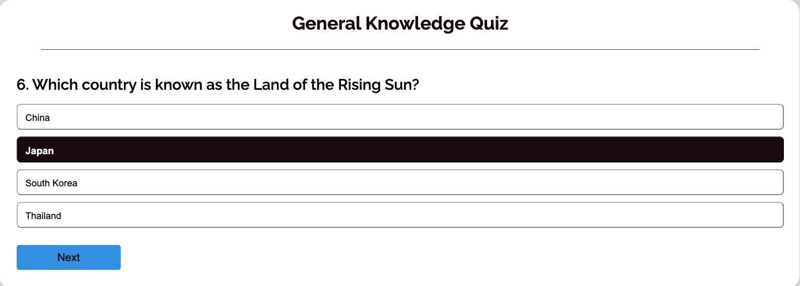

# QUIZ GAME

Welcome to the General Knowledge Quiz Game! This engaging and educational game is designed to challenge your knowledge across a broad range of topics. Whether you're a trivia enthusiast or just looking to test your wits, this game offers a fun and interactive way to learn and compete.

## Features 

### Existing Features

- __Header__

  - header contains just the page title.
  - The user can navigate easily using header logo, just clicking on it takes the user to the front page. 

- __The Landing Page__

  - The landing bage is where the user can start the quiz and there is a start button. 
  - The user can wxperience the hover effects and clicking on it can he/she start the quiz.

- __The Footer__ 

  - The footer section contains important information such as social media links. and the page logo. 
  - Users can also hover over or click on the footer links to access more detailed information about the website and the game rules.

- __Quiz Area__ 

  - In the quiz area there are, area title, question, four answer options, next button and the restart button. 

- __Quiz Area Features__ 

 - When the next button is clicked it shows the nextQuestion till the last questions where the next button will be hidden and the restart button be vissible.
- The user can choose one answer each question, if it's right one it changes to the green background Color if not it changes to the red.
 - If the user clicks on the restart button it takes to the front page.

 

### Features Left to Implement

- Make the questions random.

## UX/UI

### User Goals

- As a user I want to start the quiz quickly by clicking a button.
- As a user I want to select my answers easily and see immediately if they are correct or incorrect.
- As a user I want to move through the quiz one question at a time using a "next" button, and I want to know when I've reached the last question.
- I want the option to restart the quiz and try again if I want to improve my score.

### Site Owner Goals

- Provide users with clear visual cues, such as colors or messages, to indicate whether their answers are correct or incorrect.
- Give them the result message at the end of the quiz
- Add Social media links so the user can get more information about the quiz
- Ensure that the restart functionality works smoothly, allowing users to reset the quiz to its initial state and begin again without issues

### Target Audience
  - 

### User Stories
  - 
## Mockups
  - I use simple, consistent page layouts and responsive design.

### Header, Landing Page and Footer
  

### quiz-area 
  

## Tools & Technologies Used
-  used for version control. (`git add`, `git commit`, `git push`)
-  used for secure online code storage.
-  used as a cloud-based IDE for development.
-  used for the main site content.
-  used for the main site design and layout.
-  used for the interactivity, part of the styling, accessibility and more.
-  used for hosting the deployed front-end site.
-  used for creating wireframes.
-  used for the icons.
-  used to help debug, troubleshoot, and explain things.

## Testing

- You can find the testing document in the document folder. 
* * Game Center/assets/documents/testing.

### Validator Testing 

- HTML
  - Errors were found when passing through the official [W3C validator](Read in the documents folder in assets)
- CSS
  - No errors were found when passing through the official [(Jigsaw) validator](Read in the documents folder in assets)
- JavaScript
  - Errors were found when passing through the official [(JSHint) validator](Read in the documents folder in assets)

## Deployment

- The site was deployed as follows: 
  - Site was deployed on Github
  - [Deployed Site] (https://zakariyenor.github.io/Game-Center/)

## Credits 

- I read a view articles to come up with right typography and color [By Mark](https://www.deesignre.com/how-to-complement-typography-with-the-right-colors/)
- Questions, their four option answers was been generated by chatgpt [Chatgpt](https://chatgpt.com/)
- The icons in the footer were taken from [Font Awesome](https://fontawesome.com/)
- I watched this youtube tutorial to get some info about quiz page [Build A Quiz App With JavaScript](https://www.youtube.com/watch?v=riDzcEQbX6k)
- I watched this youtube tutorial to learn and practise forEach Method [JavaScript forEach()](https://youtu.be/uOZWH0KEUs4?si=UeFTb74MPAOfPqEO)
- I watched this youtube tutorial to learn using the => arrow with functions  [Arrow Function](https://youtu.be/fRRRkognpOs?si=TD4U_uZMbxtyW7eS)
- For the => arrow functions [ES6 Arrow Function](https://youtu.be/h33Srr5J9nY?si=3efpPR2utJ0Zkyjq)
- I watched this youtube tutorial to learn more about D.O.M [JavaScript DOM Manipulation](https://youtu.be/5fb2aPlgoys?si=rw5gcgI-lFOikM2jv)
- The icons in the footer were taken from [Click Events](https://youtu.be/g_vXSKbfUiQ?si=-IMOptRHhW3c6yhC)
- I watched this tutorial to get some information about the quiz building and the order and sequences [Create A Quiz App](https://youtu.be/WUBhpSRS_fk?si=YnHBAAW_T5KJ9WfM)
- The font-family and font-types took from [Google Font](https://fonts.google.com/?preview.layout=grid)
- Got extra help from tutor assistance [Code Institute](https://learn.codeinstitute.net/ci_support/diplomainfullstacksoftwarecommoncurriculum/tutor)
- I learned and practised how to get elements from the html, how to manibulate them, arrow functions, forEach method and more  from every video I watched and every text I read but I didn't took their code (syntax). I get the idea how to do it and first I used their code build a project then deleted all of them and started building for my own quiz game with my own code. But the some of the variable names and function names like (currentQuestionIndex) I took them from one of the video's and the some of the error texts also. 
